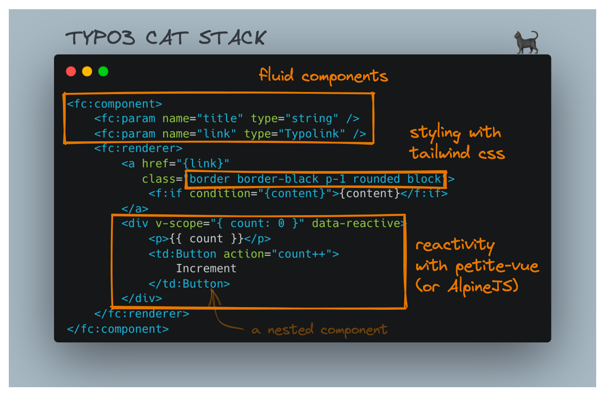

# TYPO3 Cat Stack Demo

A quick demo for TYPO3CMS with Fluid Components, AlpineJS (or petite-vue) and TailwindCSS.

[Open with Gitpod](https://gitpod.io/#https://github.com/fgeierst/typo3-11-tailwind-demo/)

## Prerequisites

- Docker Desktop
- DDEV

## Local installation guide

	git clone https://github.com/fgeierst/typo3-11-tailwind-demo.git
	cd typo3-11-tailwind-demo
	ddev start
	ddev composer install
	ddev snapshot restore --latest
	ddev npm install
	
Login via [typo3-11-tailwind-demo.ddev.site/typo3](typo3-11-tailwind-demo.ddev.site/typo3) using these credentials:

- Username: `admin`
- Password: `password`

## Start TailwindCSS and Rollup watchers in development

	ddev npm run css:dev 
	ddev npm run js:dev 

*Note*: If using DDEV make sure to have [Mutagen](https://ddev.readthedocs.io/en/latest/users/install/performance/#mutagen) enabled for the file watcher to work properly. If not, you can also run the above script outside of the docker container (`npm run css:dev`).

## Build JS and CSS for production

	ddev npm run css:build &&
	ddev npm run js:build

## Fluid Components

The UI components are encapsulated as [Fluid Components](https://github.com/sitegeist/fluid-components), located in the *Private/Components/* folder. Using fixture JSON files, you can work on individual components in isolation (similar to Storybook). The component explorer is at https://typo3-11-tailwind-demo.ddev.site/styleguide/

